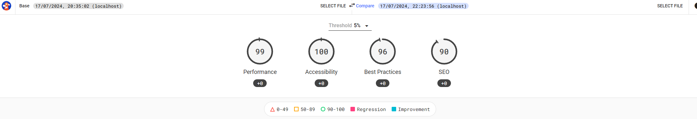
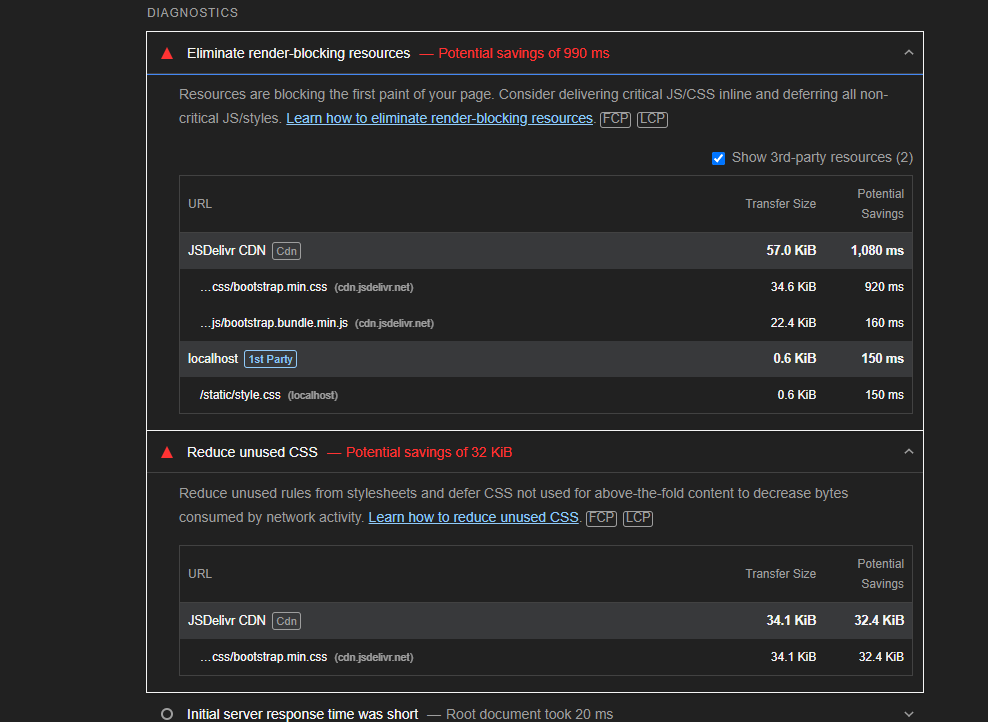
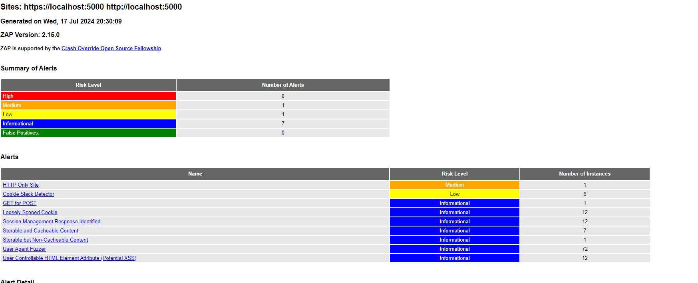

# TODO APPLICATION
This project implemenents an application that allows a user to create todo items that are stored locally.

### Features Implemented:
- adding to do
- deleting to do
- editing to do
- search filter

### TEAM
KupoKopu - Developer, Tester, Project manager
luyah231 - Developer, Tester

Project manager
Responsible for the creation of tickets and coordination with assigning tickets to developers.

Developer
Responsible for developing functionality from tickets, participating in code reviews, assisting with technical debt, testing their own implementation.

Tester
Responsible for manually testing the application to spot bugs and how complete features are.

### TOOLS
Version Control
- Git

Project management
- Jira

Testing
- unittest

Framework
- Flask (general application)
- sqlalchemy (database)

development environment
- Visual Studio Code

extensions
- Python (for general language support and integrations including linting)

linting
- autopep8

Auditing
- Lighthouse
- Zap Scan

web server (for CI pipeline)
- gunicorn

### INSTRUCTIONS
- have python installed with pip (developed and tested with python 3.12.0)
- clone repo
- install requirements `pip install -r requirements.txt`
- go in to terminal at root of repo
- run the app `flask run`
- a browser tab will open with the localhost app or you can enter the `http://localhost:5000/index` url in the command line into your browser

### DEV INSTRUCTIONS
- have python installed with pip (developed and tested with python 3.12.0)
- install flask `pip install flask`
- install autopep8 `pip install autopep8`
 - project already has workspace settings for auto-formatting via autopep8
- clone repo
- go in to terminal at root of repo
- run the app `flask run`
- a browser tab will open with the localhost app or you can enter the `http://localhost:5000/index` url in the command line into your browser

### Useful commands
`python -m unittest .\path\to\test_file.py` - run unit testing
`coverage run -m unittest discover` - run discoverable tests + analyze coverage
`coverage report` - generates report on coverage
`pip freeze > requirements.txt` - store new dependencies in text file for easier installation
`flask db migrate -m "comment"` - generate new migration file for updating database
`flask db upgrade` - update database with migrations file

### PROJECT WORKFLOW
using kanban board and backlog. Tickets are created and stored in the backlog to be taken out into sprint.
Tickets are assigned and when code complete, are put up a pull request to be reviewed and merged.

Security reports generated from Zap scan github actions will be used to address security by creating future response tickets.

### TEST METHODOLOGY
Test Driven Development.

Create tests before implementation of ticket. Use the tests to as a blueprint for the code.

Mix of unit testing on functionality stored in services and data models

Create unit tests with happy path for ticket, code till happy path is achieved.
Create other unit tests to deal with edge case scenarios like errors, wrong input.

When submitting a pull request, share screenshots of:
- changes made
- generated lighthouse report

Github actions will run:
- coverage test with requirements of more than 80%
- lighthouse test for accessibility
- zap scan for security

Code reviews
Use code reviews to assess code against coding best practices. Approve the pull request or comment any improvements.

### CODING BEST PRACTICES
- Write Readable and meaningful code
 - 'calculate_total' is more descriptive than 'calc'
- Use snake_case for variables and camelCase for class names
- Write modular code, if it is reusable then it should be it's own method/function
- Group related functions and classes
- Use Logging rather than print statements for logging runtime information
- Use specific exception types when throwing and handling errors
- Inline comments are for why an approach is taken, not what it does
- Docstring to describe the purpose of the function, class or module
- follow PEP 8 Style Guide
 - Indentation: Use 4 spaces per indentation level.
 - Line Length: Limit all lines to a maximum of 79 characters.
 - Blank Lines: Separate top-level function and class definitions with two blank lines. Use single blank lines to separate method definitions inside a class.
 - Imports: Import all modules at the beginning of the file, usually in three groups: standard library imports, related third-party imports, and local application/library-specific imports.
 - and much more...
 - this can be easily done with autopep8 automatic linting

### CI PIPELINES
Github Actions are used to automate test coverage, accessibility, performance and security reports.

Coverage CI
Used to confirm quality of code by asserting code coverage is over 80%

Lighthouse CI
Generate Accessibility and Performance Reports

Zap Scan CI
Generate Security Reports

### STANDARDS
IEEE 730
Standard for a Software Quality Assurance (SQA) plan.
Objective is to ensure software meets it's requirements and is of quality by defining systematic processes, tasks and responsibilities to ensure quality.

Reasons to following this Standard:
- Widely accepted industry standard
- flexible and scalable from small to big projects
- Encourages continuous imrpovement by aligning with agile and iterative development

To meet this standard the project will:
- assign roles and responsibilities
- implement processes to verify and validate the application through unit testing and end to tend testing
- manage risk by implementing a plan for implementation of the project

### PERFORMANCE AND ACCESSIBILITY AUDITS

Overall Score is positive for performance and accessibility.

Web app accessibility is great with all interactable elements traversable via keyboard. Other Accessibility avenues could be explored like:
- Alt Text for images
- High colour contrast
- large interactive elements

Performance is great however can still be improved. Custom CSS could be used to then remove bootstrap CDN to reduce bloat of all the styling and interactivity not used by the web app.

### SECURITY AUDIT

Security Audit is good.

There are no high severity issues and the only medium severity issue is "HTTP only site". This is negligible for now as the web app is designed for localhost use. However, if to be used in a production environment with the port exposed, it is crucial to implement SSL certificates into the web application.
